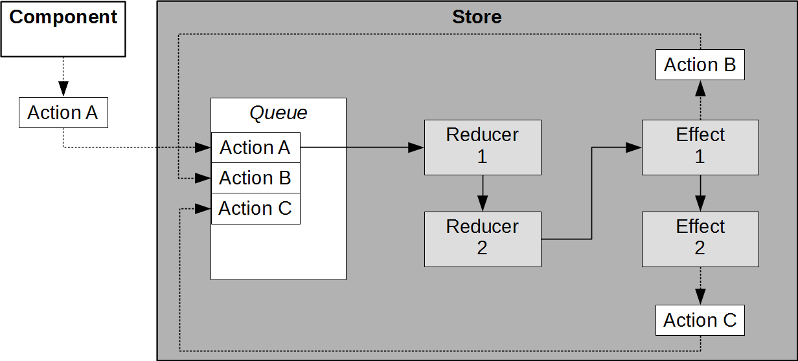

# NgRx – Flow of actions and effects

Please first read the following documents carefully:

* [ngrx actions](https://ngrx.io/guide/store/actions)
* [ngrx reducers](https://ngrx.io/guide/store/reducers)
* [ngrx effects](https://ngrx.io/guide/effects)

Examplery flow:

1. An action A is dispatched from a component.
2. It is first processed by all reducers.
3. After the new state is set by the reducers effects listening for the action are executed.
4. Effects can produce new actions B/C.
5. New actions are only processed after all effects are executed.
6. The cycle restarts at 2. with the first dispatched new action B.

It is useful to think of a simple queue of actions managed by the store. Dispatched actions (sync or async) are processed one after the other first by the reducers then by the effects.

