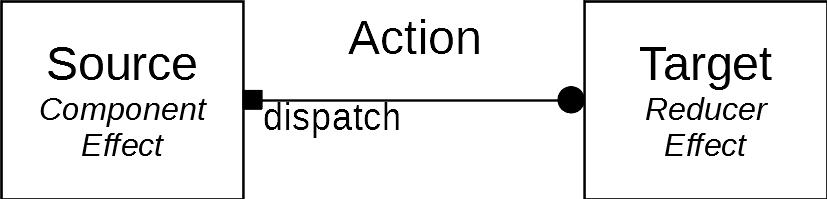
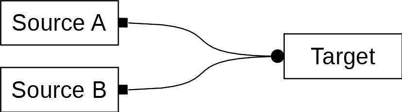
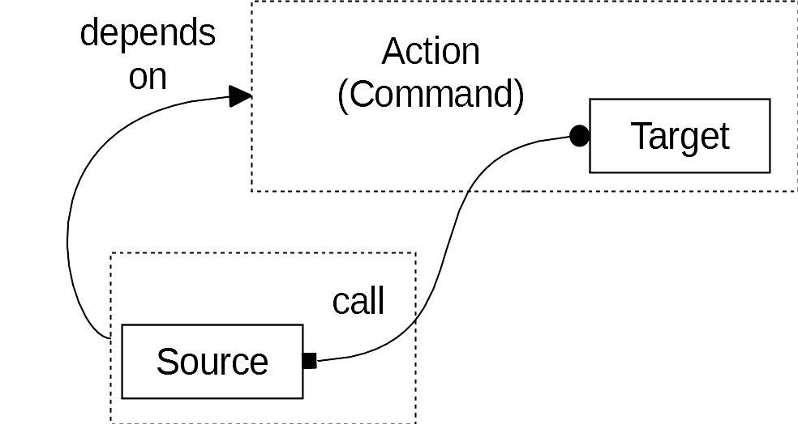
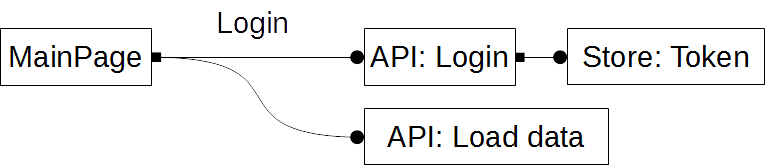
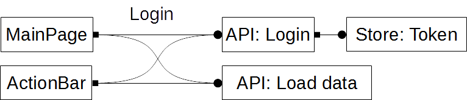
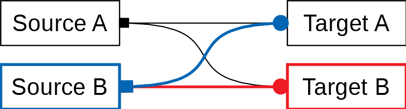
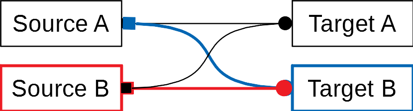
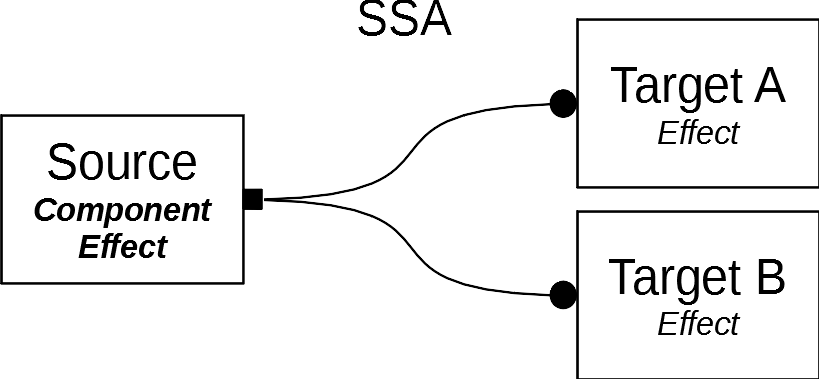
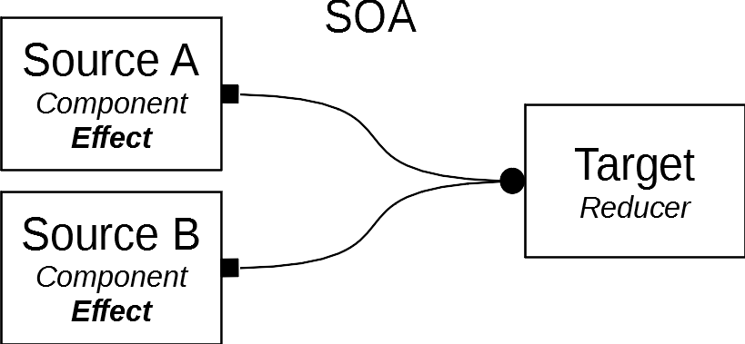
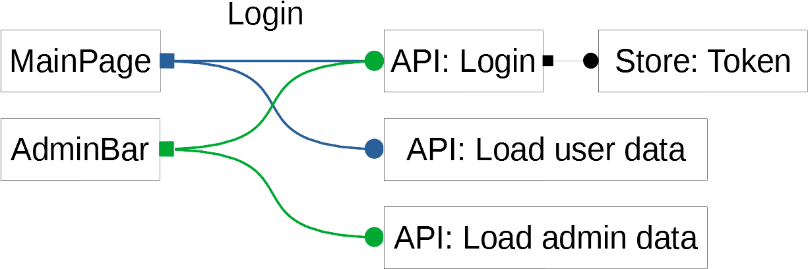

# NgRx - Actions

## Table of contents

* [Overview of using actions](#overview-of-using-actions)
* [Single source and multi source actions](#single-source-and-multi-source-actions)
* [Command and event behaviour](#command-and-event-behaviour)

## Overview of using actions

Actions are part of the commonly used redux programming pattern. We use the NgRx (Angular Redux) library for our projects.

### Documentation

Please read carefully the NgRx documentation for actions:

* [NgRx actions](https://ngrx.io/guide/store/actions)

There are many blogs talking about actions and how to use them. These blogs are read to be carefully. There is no common pattern to use actions and the overall community opinions are often inconsistent. So this document defines a clear pattern to use actions in our projects. This is to overcome inconsistencies and problems and make developing easier, faster and more bug free.

### Why to use actions

Actions are mainly used to describe the UI- and application flow and the corresponding state transitions of an app.

Actions can be triggered by different sources:

* The user interacting with the app
* The app reacting to a server event
* The app reacting to other actions

Actions can be handled to do different things:

* Calling an API or a service
* Triggering new actions
* Manipulating the app state

### Where to use actions

For a developer there are two main places where to use actions:

#### An action can be dispatched by a source

An action can be dispatched by different sources anywhere in the code. This could be e.g. a component, an effect or a service. Note that it is not recommended to dispatch actions from services.

#### A target can react to an action

There are two patterns to react to an action:

* You can reduce an action with a reducer to change the state of the store. This can trigger a state change of some component using a selector from this state.
* You can also react to the action by using an effect and trigger state changes by calling services or dispatching new actions in the effect.

Both patterns change the state of the app, so these are both referenced as a target reacting to an action in this document.

### Actions with multiple sources

Actions can have multiple sources. Different components or effects can dispatch the same action.

### Actions with multiple targets

Actions can have multiple targets. Different effects and reducers can react to the same action.

Targets can also be chained. So a target can dispatch another action which is handled again by another target.

### Problems with using actions

There are many possibilities for a developer to interact with actions. Actions can be defnied anywhere, dispatched anywhere and handled anywhere in the code. This is intended by redux and named loosely coupling of an app's components. Without a common pattern restricting the usage of actions and defining how to couple the components it quickly becomes unclear where to interact with actions and how the application flow actually works. This produces bugs and makes the code difficult to maintain.

chaos by using actions

So we define some common patterns the developer should use. We also define different types of actions to make it easier, clearer and safer to use actions.

## Event based and command based actions

Actions can behave like events or commands. This depents on how and where an action is defined, and how and where targets react to the action.

### Overview: Event based action

Event behaviour means that a source defines the actions it uses and dispatches them to trigger events. The targets live down the hierarchy and handle these events.

banner as event

### Overview: Command based action

Command behaviour means that actions are defined somewhere up the hierarchy and a source can dispatch them to call some functionality described by the actions. The targets can live up or down the hierarchy to process the commands.

banner as command

### Problem: Mixing event and command actions

During developing it can happen that command and event behaviour of actions get mixed up. For another developer it becomes unclear where actions should be dispatched and where they should be handled. It is also easier to produce circular dependencies between modules and sub modules which prevents reusability of components and a clear component hierarchy.

example mixed up

### Solution: Using command actions only

To avoid mixing action behaviour we decide that actions always behave like commands. Independent of the sources and targets, dispatching an action means calling a command and not triggering an event.

### Example: Command actions

same example only with commands

## Naming actions

### Overview: Name and type string

### Problem: Describing events and commands

### Solution: Describe commands

### Example: Naming actions

    <Name><Suffix>.type = '[<Module>/] <Description>'
  
* The name of the action describes the intent of the action / next state of the application.
* The suffix corresponds to the action types described later.
* The module and sub module point to the location where the action is defined. It is not the location where it is used.
* The description is a more detailed but short information about the action's intent.

## Single source and multi source actions

Actions can be differentiated by the number of sources dispatching these actions.

### Overview: Single source action

This is an action as recommended by NgRx. It has a single unique source, that means there is only one line of code where it is dispatched. These actions behave like an event. A source is triggering the event and the targets are subscribing to that event.

The action can be used when there is a unique event (like a click on a unique login button) with a unique chain of targets handling the action.
  

### Overview: Multi source action

This is an action with multiple sources. It has no information about the specific source it was dispatched from. All targets react to the action in the same way. These actions behave like an operation. A source is calling the operation and the targets proccess that operation.

This action can be used when multiple sources (like multiple login buttons on the page) have the same effects in the application.
  

### Problem: Using multi source actions is unsafe

By using actions it is easy to produce bugs that are difficult to trace. These bugs are mainly produced if an action is dispatched from different sources. So it is recommended by NgRx to use only actions with a single unique source.

We decided to use also actions with different sources, but take special precautions to avoid undesired behaviour.

The problems mainly occur if different developers, or the same developer at different times uses an already defined action. The following use cases try to explain these problems. In all examples a second developer uses actions with an already defined action-target flow by a first developer.

#### A developer dispatches a new action from source B, unaware of target B

The developer dipatches an already defined action from a new component. He is aware of Target A and the corresponding side effect. He is not aware of Target B, but target B produces an undesired side effect not intended by the developer for the new component.

#### A developer adds a new target B, unaware of source B

The developer writes a new target B with a side effect for an action. He is targeting source A of that action. He is unaware of source B. The new target B produces a side effect with undesired results for source B.

### Solution: SSA and MSA

To avoid the described problems we introduce different action types. The types define how an action should be used. It makes it clear for another developer how to use an already defined action and what precautions to take. The action type is determined by a suffix to the action's name and the action's type string.

### SSA: Single source actions

This is an action describing the application flow. It has a single source and can have multiple targets. If some state change is necessary before the action is handled the source should dipsatch a seperate SOA action.

#### Where to use it (SSA)

* The action can only be dispatched by a single source.
* The action can have multiple targets. It is not recommended to use a reducer as a target for the action.

#### Where to define it (SSA)

SSA actions should be defined in a seperate action file in a module or sub module folder. The file should describe the flow of a part of the application.

#### Precautions (SSA)

* A developer is not allowed to reuse this action. But he can change the action to a MSA action, check all targets and side-effects and then reuse the action.
* A developer is allowed to add new targets for the action. It is not recommended to write reducers for the action.

### Example: SSA

    LoginSSA.type = '[User/Authentification] Login user with given credentials'

### MSA: Multi source action

A MSA action is the same as a SSA action with multiple sources. All sources get the same effects by dispatching the action.

#### Where to use it (MSA)

* The action can be dispatched by multiple sources. Mainly it should be dispatched by components.
* The action can have multiple targets. It is not recommended to use a reducer as a target for the action.

#### Where to define it (MSA)

It should be defined in the same place as the corresponding SSA actions.

#### Precautions (MSA)

* A developer is allowed to reuse this action. He must check all sources and targets of the action for undesired side-effects when dispatching it again.
* A developer is allowed to add a new target for the action. He must check all sources and targets of the action for undesired side-effects produced by the new target.

### Example: MSA

    ValidateUserMSA.type = '[User/Authentification] Check if the user is still valid'

## Application flow and data storage actions

We seperate actions in actions manipulating the state and actions describing the application flow.

### Overview: Application flow action

### Overview: Data storage action

### Problem: Mixing application flow and data storage

### Solution: SOA

### SOA: State operation action

The SOA action is the action manipulating the state. It should follow the CRUD guidelines. Whenever a source whants to change some data in the state it dispatches a SOA action. If a side effect follows the state change the source should dispatch a seperate none SOA action describing the side effect.

#### Where to use it (SOA)

* The action can be dispatched from multiple sources. Mainly it should be dispatched by effects.
* The action should be consumed by only one reducer. It is not allowed to write effects for the action.

#### Where to define it (SOA)

SOA actions should be defined in a seperate action file in the state folder of the corresponding reducer.

#### Precautions (SOA)

* A developer is allowed to reuse this action.
* A developer is not allowed to add new targets for the action

### Example: SOA

    UpdateUserNameSOA.type = '[User/UserData] Sets a new user name'

## Multi target actions

### Overview: Actions with multiple targets

This is a special use case of a multi source action and must be explicitly implemented by the developer. It has information about the specific source it was dispatched from. Targets can react accordingly to the action's source. These actions behave like an event with information about the sender of the event.

#### Use case (multi target)

This action can be used when multiple sources (like a an admin login button and an user login button) trigger different side effects (like loading different data after logged in) and have also a common side effect (like calling the login API).

#### Example (multi target)

### Problem: Identify multi target actions

### Solution: MTA

The MTA action is the same as a MSA action besides there can be different effects for different sources. To use MTA actions the developer must implement a technique to store the source of an action.

#### Where to use it (MTA)

* The action can be dispatched by multiple sources. Mainly it should be dispatched by effects.
* The action can have multiple targets. It is not recommended to use a reducer as a target for the action.

#### Where to define it (MTA)

MTA actions should be defined in a seperate action file. It should be placed in the sub module folder of the corresponding effects/services handling the action.

#### Precautions (MTA)

* A developer is allowed to reuse this action. He must handle the new source in the desired targets of the action.
* A developer is allowed to add a new target for the action. He must specify the sources the new target shall listen for.

### Example: MTA

    OpenDialogMTA.type = '[Shared/Dialog] Open a confirmation dialog'

