# NgRx - Actions

## Table of contents
* [Overview of using actions](#overviewLink)
* [Problems with using actions](#problemsLink)
* [Differentiate actions](#differentiateLink)
* [Style guide](#guideLink)
* [Example](#exampleLink)

## Overview of using actions 
**Style guide for defining actions**
* https://ngrx.io/guide/store/actions

Actions are mainly used to describe the UI-Flow and corresponding state transitions of an app. They can be triggered by different sources:
* The user interacting with the app
* The app reacting to a server event
* The app reacting to other actions and their side effects

For a developer there are two main places where to use actions:

**An action can be dispatched by a source**

An action can be dispatched by different sources anywhere in the code. This could be e.g. a component, an effect or a service. Note that it is not recommended to dispatch actions from services.

**A target can react to an action**

There are two patterns to react to an action:
* You can reduce an action with a reducer to change the state of the store. This can trigger a state change of some component using a selector from this state.
* You can also react to the action by using an effect and trigger state changes by calling services or dispatching new actions in the effect.

Both patterns change the state of the app, so these are both referenced as a target reacting to an action in this document.

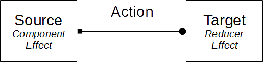

## Problems with using actions 
By using actions it is easy to produce bugs that are difficult to trace. These bugs are mainly produced if an action has different sources and targets. So it is recommended by NgRx to use only actions with a single unique source. We decided to use also actions with different sources, but take special precautions to avoid undesired behaviour.

### Different sources
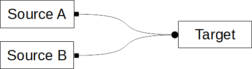

### Different targets
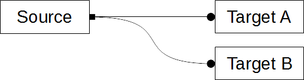

### Target chain
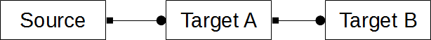

The problems mainly occur if different developers, or the same developer at different times uses an already defined action. The following use cases try to explain these problems. In all examples a second developer uses actions with an already defined action-target flow by a first developer.

### Example 1: A developer dispatches new action from source B, unaware of target B
The developer dipatches an already defined action from a new component. He is aware of Target A and the corresponding side effect. He is not aware of Target B, but target B produces an undesired side effect not intended by the developer for the new component.

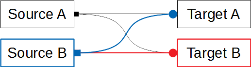

### Example 2: A developer adds a new target B, unaware of source B
The developer writes a new target B with a side effect for an action. He is targeting source A of that action. He is unaware of source B. The new target B produces a side effect with undesired results for source B.

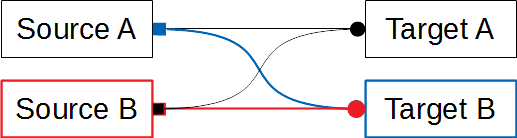

## Differentiating actions 

Actions can be differentiated by the number of sources dispatching these actions. If there are multiple sources it is also relevant if there are differnt targets for different sources.

### Single source action
This is an action as recommended by NgRx. It has a single unique source, that means there is only one line of code where it is dispatched. These actions behave like an event. A source is triggering the event and the targets are subscribing to that event.

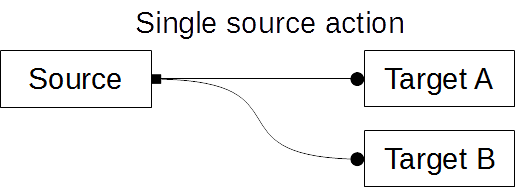

#### Use case
The action can be used when there is a unique event (like a click on a unique login button) with a unique chain of targets handling the action.
  
#### Example
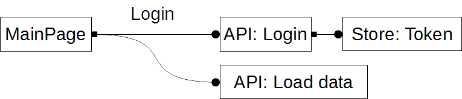

### Multi source action (same targets)
This is an action with multiple sources. It has no information about the specific source it was dispatched from. All targets react to the action in the same way. These actions behave like an operation. A source is calling the operation and the targets proccess that operation.

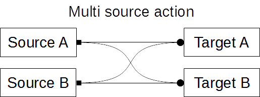

#### Use case
This action can be used when multiple sources (like multiple login buttons on the page) have the same effects in the application.
  
#### Example
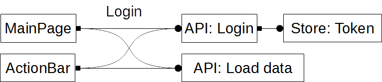

### Command action (multiple sources, different targets)
This is an action with multiple sources. It has information about the specific source it was dispatched from. Targets can react accordingly to the action's source. These actions behave like an event with information about the sender of the event. 

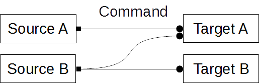

#### Use case
This action can be used when multiple sources (like a an admin login button and an user login button) trigger different side effects (like loading different data after logged in) and have also a common side effect (like calling the login API).
    
#### Example
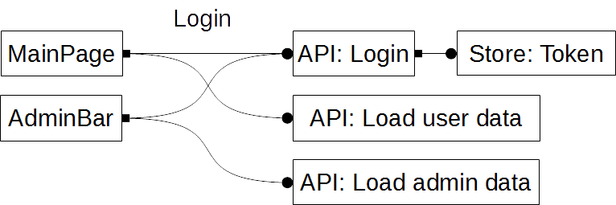

## Style Guide 
To reduce bugs from the described problems we define rules for using actions by defining different types of actions. We also define some naming conventions and file placement conventions.

### Naming convention
    <Name><Suffix>.type = '[<Module>/] <Description>'
  
* The name of the action describes the intent of the action / next state of the application.
* The suffix corresponds to the action types described later.
* The module and sub module point to the location where the action is defined. It is not the location where it is used.
* The description is a more detailed but short information about the action's intent.

### SOA - State operation action (multi source action, one target)
To make it for the developer easier to decide if using an action is safe, we seperate actions in actions manipulating the state and actions describing the application flow. The SOA action is an action manipulating the state. It should follow the CRUD guidelines.
Whenever a source whants to change some data in the state it dispatches a SOA action. If a side effect follows the state change the source should dispatch a seperate action describing the effect.

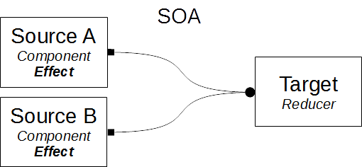

#### Where to use it
* The action can be dispatched from multiple sources. Mainly it should be dispatched by effects.
* The action should be consumed by only one reducer. It is not allowed to write effects for the action.

#### Where to define it
SOA actions should be defined in a seperate action file in the state folder of the corresponding reducer.

#### Precautions
* A developer is allowed to reuse this action.
* A developer is not allowed to add new targets for the action.

#### Example
    UpdateUserNameSOA.type = '[User/UserData] Sets a new user name'

### SSA - Single source action
This is an action describing the application flow. It has a single source and can have multiple targets. If some state change is necessary before the action is handled the source should dipsatch a seperate SOA action.

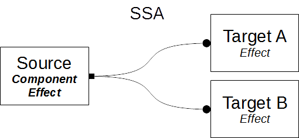

#### Where to use it
* The action can only be dispatched by a single source.
* The action can have multiple targets. It is not recommended to use a reducer as a target for the action.

#### Where to define it
SSA actions should be defined in a seperate action file in a module or sub module folder. The file should describe the flow of a part of the application.

#### Precautions
* A developer is not allowed to reuse this action. But he can change the action to a MSA action, check all targets and side-effects and then reuse the action.
* A developer is allowed to add new targets for the action. It is not recommended to write reducers for the action.

#### Example
    LoginSSA.type = '[User/Authentification] Login user with given credentials'

### MSA - Multi source action (same targets)
A MSA action is the same as a SSA action with multiple sources. All sources get the same effects by dispatching the action.

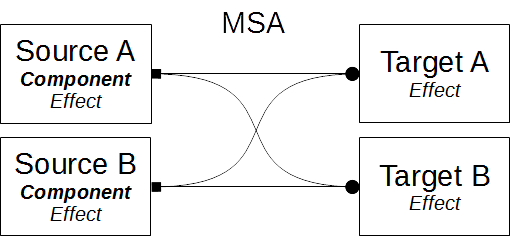

#### Where to use it
* The action can be dispatched by multiple sources. Mainly it should be dispatched by components.
* The action can have multiple targets. It is not recommended to use a reducer as a target for the action.

#### Where to define it
It should be defined in the same place as the corresponding SSA actions.

#### Precautions
* A developer is allowed to reuse this action. He must check all sources and targets of the action for undesired side-effects when dispatching it again.
* A developer is allowed to add a new target for the action. He must check all sources and targets of the action for undesired side-effects produced by the new target.

#### Example   
    ValidateUserMSA.type = '[User/Authentification] Check if the user is still valid'

### CA - Command action (multiple sources, different targets)
The CA action is the same as a MSA action besides there can be different effects for different sources.

To use command actions the developer must implement a technique to store the source of a command. For the use case of sources behave differently after calling a command there is an already implemented command/response pattern. It is described in our corresponding NgRx-CommandAPI document.

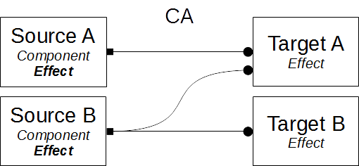

#### Where to use it
* The action can be dispatched by multiple sources. Mainly it should be dispatched by effects.
* The action can have multiple targets. It is not recommended to use a reducer as a target for the action.

#### Where to define it
CA actions should be defined in a seperate action file. It should be placed in the sub module folder of the corresponding effects/services handling the command.

#### Precautions
* A developer is allowed to reuse this action. He must handle the new source in the desired targets of the action.
* A developer is allowed to add a new target for the action. He must specify the sources the new target shall listen for.

#### Example
    OpenDialogCA.type = '[Shared/Dialog] Open a confirmation dialog'

## Example 
The example describes and app with some sample data which can be deleted from a sample list and an app bar. As a safe guard the user must confirm the deletion. The confirmation dialog is a reusable shared component. It uses a command/response pattern with the corresponding CA- and RA actions to demonstrate the usage of command actions.

### Folder structure
    shared (module)
      dialog (sub module)
        dialog.component
        dialog.actions
        dialog.effects
        ...
    samples (feature module)
      sampleData (sub module)
        sampleData.model
        state
          sampleData.actions
          sampleData.reducer
          sampleData.selectors
      samples.actions
      samples.effects
      sampleList.Component
    main-page (main feature)
      appBar (sub module)
        appBar.component
        appBar.effects
      banner (sub module)
        banner.effects
      
### Actions
    shared/dialog/dialog.actions
      DialogOpenCA.type = '[Shared/Dialog] Open a confirmation dialog'
      DialogConfirmRA.type = '[Shared/Dialog] Dialog confirmed'
    
    samples/sampleData/state/sampleData.actions
      SampleDataDeleteAllSOA = '[Samples/SampleData] Delete all sample data'
    
    samples/samples.actions
      SamplesDeleteAllMSA = '[Samples] Delete all samples'
      SamplesDeleteSuccessSSA = '[Samples] Deleted sampels successfully'

### Chart

