# NgRx - Actions

## Table of contents

* [Overview](#overview-of-using-actions)
* [Events and commands](#event-based-and-command-based-actions)
* [Naming convention](#naming-actions)
* [Single source and multi source](#single-source-and-multi-source-actions)
* [Multi target actions](#multi-target-actions)
* [Application flow and data storage](#application-flow-and-data-storage-actions)
* [Summary](#summary)

### Quick reference

* [Commands](#solution-using-command-actions-only)
* [Names](#naming-actions)
* [SSA: Single source action](#ssa-single-source-action)
* [MSA: Multi source action](#msa-multi-source-action)
* [MTA: Multi target action](#mta-multi-target-action)
* [SOA: State operation action](#soa-state-operation-action)
* [Summary](#summary)

## Overview of using actions

### Documentation

Please read carefully the NgRx documentation for actions:

* [NgRx actions](https://ngrx.io/guide/store/actions)

Because there is no common pattern to use actions and the overall community opinions are often inconsistent we define a clear pattern to use actions in our projects. This is to overcome the inconsistencies and make developing easier, faster and more bug free.

### Why to use actions

Actions are mainly used to describe the UI- and application flow and the corresponding state transitions of an app.

Actions can be triggered by different sources:

* The user interacting with the app
* The app reacting to a server event
* The app reacting to other actions

Actions can be handled to do different things:

* Calling an API or a service
* Triggering new actions
* Manipulating the app state

### Where to use actions

For a developer there are two main places where to use actions:

#### An action can be dispatched by a source

An action can be dispatched by different sources anywhere in the code. This could be e.g. a component, an effect or a service. Note that it is not recommended to dispatch actions from services.

#### A target can react to an action

There are two patterns to react to an action:

* You can reduce an action with a reducer to change the state of the store. This can trigger a state change of some component using a selector from the store.
* You can also react to the action by using an effect and trigger state changes by calling services or dispatching new actions in the effect.

Both patterns change the state of the app, so these are both referenced as a target reacting to an action in this document.

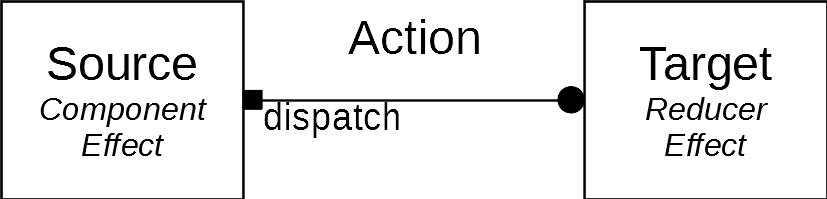

### Actions with multiple sources

Actions can have multiple sources. Different components or effects can dispatch the same action.

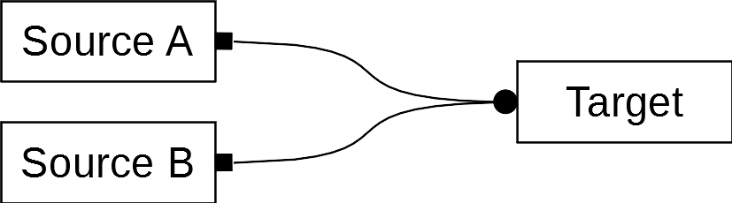

### Actions with multiple targets

Actions can have multiple targets. Different effects and reducers can react to the same action.

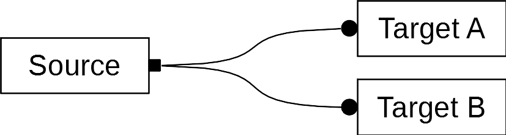

Targets can also be chained. So a target can act as a source and dispatch another action which is handled again by another target.

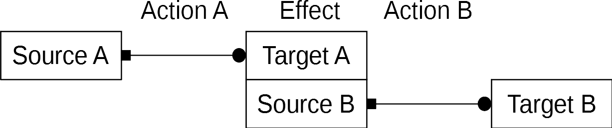

### Problems with using actions

There are many possibilities for a developer to interact with actions. Actions can be defnied anywhere, dispatched anywhere and handled anywhere in the code. This is intended by redux for loosely coupling of an app's components. Without a common pattern restricting the usage of actions and defining how to couple the components it quickly becomes unclear where to interact with actions and how the application flow actually works. This produces bugs and makes the code difficult to maintain.
So we define some common patterns the developer should use. We also define different types of actions to make it clearer when and how to use an action.

## Event based and command based actions

Actions can have an event or a command character. This depents on how and where an action is defined, and how and where targets react to the action. Commonly the name and description of an action reflects that behaviour.

### Overview: Event based action

Event behaviour means that a source triggers an event that gets handled by the targets. 

* The dispatched action describes an event of the source.
* It is declared by the part of the application dispatching the action.
* The source is unaware of what happens when the action is dispatched.
* The targets need knowledge of the source to handle the action.

The development order could be:

* Define a component
* Define the actions dispatched by the component
* Define targets to react to the actions

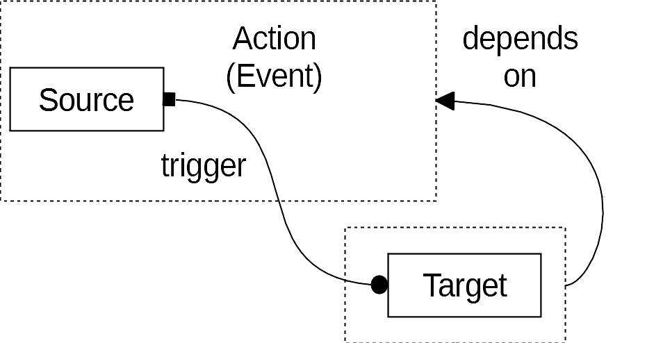

### Overview: Command based action

Command behaviour means that a source calls a command that is handled by the targets.

* The dispatched action describes a command to be executed.
* It is declared by the part of the application handling the action.
* The source is aware of what happens when the action is dispatched.
* The targets do not need knowledge of the source to handle the action.

The development order could be:

* Define actions
* Define targets to react to the actions
* Define components dispatching the actions

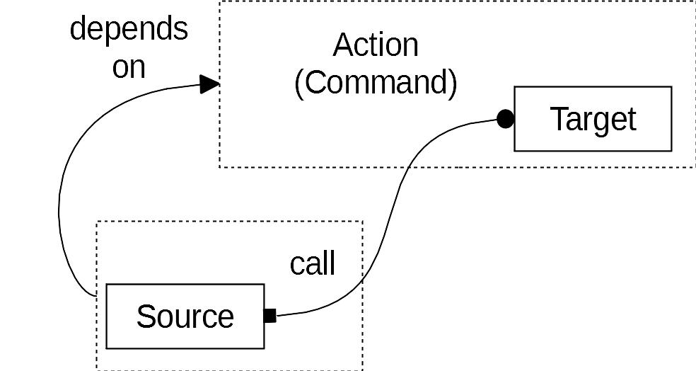

### Problem: Mixing event and command actions

During developing it can happen that command and event behaviour of actions get mixed up. For another developer it becomes unclear where actions should be dispatched and where they should be handled. It is also easier to produce circular dependencies between modules and sub modules which prevents reusability of components and a clear component hierarchy.

It follows an example of an actual bug in the mibi-portal-client.

Desired behaviour:

* On sending samples to the server the samples gets first validated by the server. If the samples have validation errors the server sends the validated samples back. In the client sending is interrupted and a banner is shown via a DisplayBannerAction to inform the user. The validated samples are stored in the app via a ValidateSuccessAction.

Bug:

* The ValidateSuccessAction is also handled by the BannerReducer. It hides the banner on successful server operations. The developer of the SendSamplesEffect was not aware of this behavior. So he dispatched a DisplayBannerAction to inform the user of validation errors and a ValidateSuccessAction to store the validated samples, in that order. The result was that the banner was shortly displayed and then hidden again.

Problem:

* The DisplayBannerAction has command character and the ValidateSuccessAction has event character. Both actions manipulate the banner state. For a developer this behaviour is unclear by dispatching the actions. This behaviour also adds a circular dependency between the part of the code handling banners and the part handling the samples. The SendSamplesEffect imports the DisplayBannerAction of the core module and the BannerReducer imports the ValidateSuccessAction of the samples feature module.

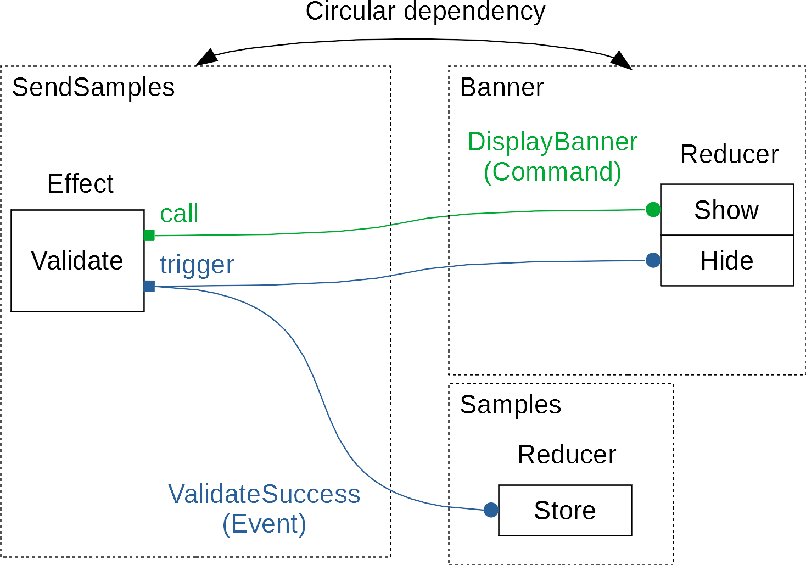

### Solution: Using command actions only

To avoid mixing action behaviour we decide that actions always behave like commands. Independent of the sources and targets, dispatching an action means calling a command and not triggering an event.

Possible solution for the banner bug discussed earlier:

* The ValidateSuccessAction is removed and a StoreSamplesAction is introduced. The new action has command behaviour. The StoreSamplesAction has no hide banner behaviour anymore. If it is intended to hide the banner after a successful validation a HideBannerAction must be explicitly dispatched. This makes it more clear for a developer what happens when he dispatches those actions. Also the circular dependency is removed. The banner reducer does not need to import an action from the samples feature module anymore.

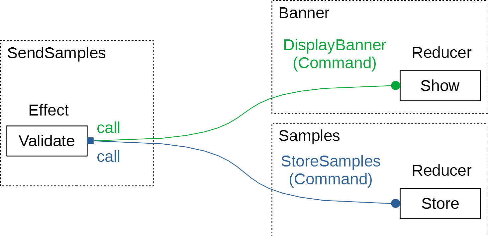

## Naming actions

To make it clear that an action describes a command and what type an action is of, we introduce a naming convention:

    <Name><Suffix>.type = '[<Module>/] <Description>'
  
* The name of the action describes the intent of the action / next state of the application.
* The suffix corresponds to the action types described later.
* The module and sub module point to the location where the action is defined. It is not the location where it is used.
* The description is a more detailed but short information about the action's intent.

## Single source and multi source actions

Actions can be differentiated by the number of sources dispatching these actions.

### Overview: Single source action

This is an action as recommended by NgRx. It has a single unique source, that means there is only one line of code where it is dispatched. These actions behave more like an event. A source is triggering the event and the targets are subscribing to that event.

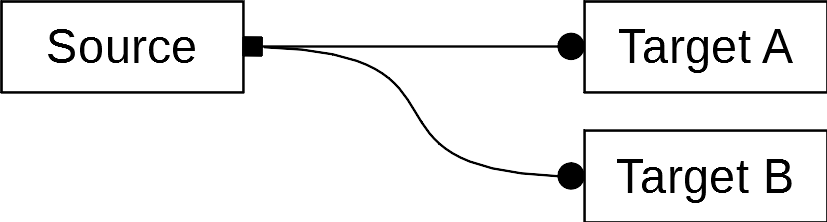

The action can be used when there is a unique event (like a click on a unique login button) with a unique chain of targets handling the action.
  
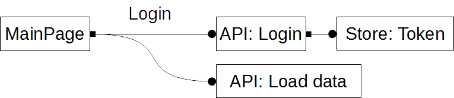

### Overview: Multi source action

This is an action with multiple sources. It has no information about the specific source it was dispatched from. All targets react to the action in the same way. These actions behave like an operation. A source is calling the operation and the targets proccess that operation.

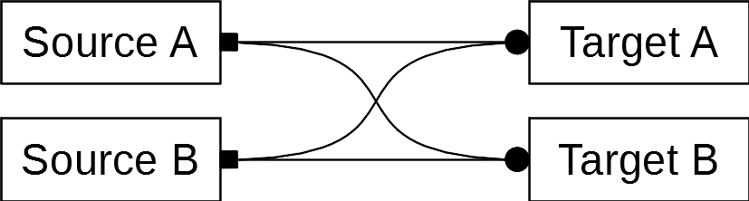

This action can be used when multiple sources (like multiple login buttons on the page) have the same effects in the application.
  
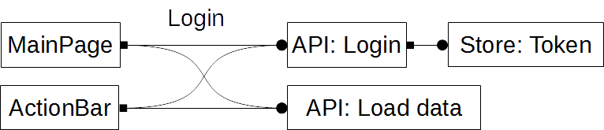

### Problem: Using multi source actions is unsafe

By using actions with multiple sources it is easy to produce bugs that are difficult to trace. So it is recommended by NgRx to use only actions with a single unique source. We decided to use also actions with mulitple sources, but take special precautions to avoid undesired behaviour.

The problems mainly occur if different developers, or the same developer at different times uses an already defined action. The following use cases try to explain these problems. In all examples a second developer uses actions with an already defined action-target flow by a first developer.

#### A developer dispatches a new action from source B, unaware of target B

The developer dipatches an already defined action from a new component. He is aware of Target A and the corresponding side effect. He is not aware of Target B, but target B produces an undesired side effect not intended by the developer for the new component.

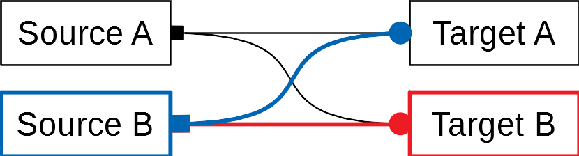

#### A developer adds a new target B, unaware of source B

The developer writes a new target B with a side effect for an action. He is targeting source A of that action. He is unaware of source B. The new target B produces a side effect with undesired results for source B.

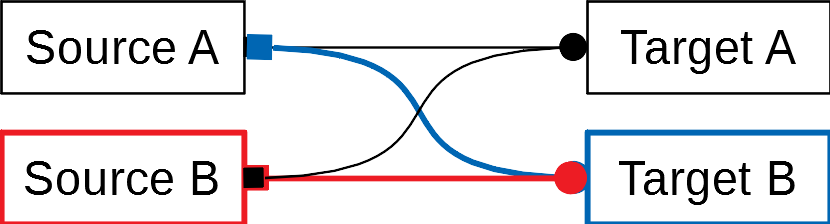

### Solution: SSA and MSA

To avoid the described problems we introduce different action types. The types define how an action should be used. It makes it clear for another developer how to use an already defined action and what precautions to take. The action type is determined by a suffix to the action's name and the action's type string.

First we separate actions by the number of sources. Actions can be single source ations with a unique single source (one unique dispatch) or multi source actions with more than one source (e.g. different components).

### SSA: Single source action

This is an action describing the application flow.

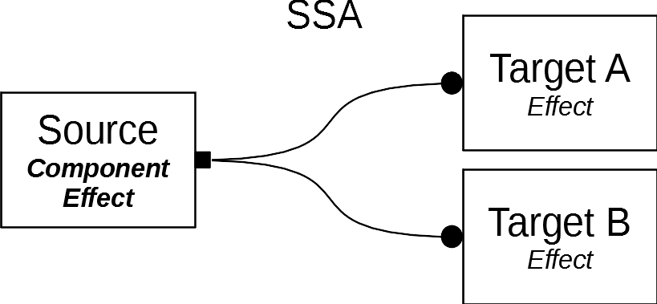

Where to use it:

* The action can only be dispatched by a single source.
* The action can have multiple targets. It is not recommended to use a reducer as a target for the action (See SOA).

Where to define it:

* SSA actions should be defined in a seperate action file in a module or sub module folder. The file should describe the flow of a part of the application.

Precautions

* A developer is not allowed to reuse this action. But he can change the action to a MSA action, check all targets and side-effects and then reuse the action.
* A developer is allowed to add new targets for the action.

### Example: SSA

    LoginSSA.type = '[User/Authentification] Login user with given credentials'

### MSA: Multi source action

This is an action describing the application flow.

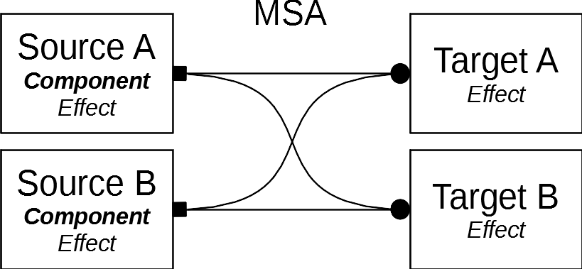

Where to use it

* The action can be dispatched by multiple sources. Mainly it should be dispatched by components.
* The action can have multiple targets. It is not recommended to use a reducer as a target for the action (See SOA).

Where to define it

* It should be defined in the same place as the corresponding SSA actions.

Precautions

* A developer is allowed to reuse this action. He must check all sources and targets of the action for undesired side-effects when dispatching it again.
* A developer is allowed to add a new target for the action. He must check all sources and targets of the action for undesired side-effects produced by the new target.

### Example: MSA

    ValidateUserMSA.type = '[User/Authentification] Check if the user is still valid'

## Command response pattern

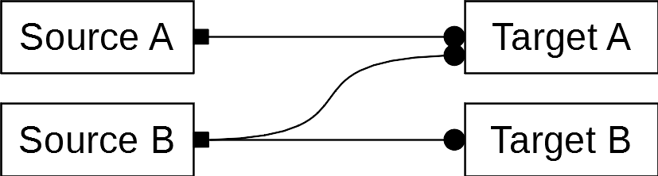

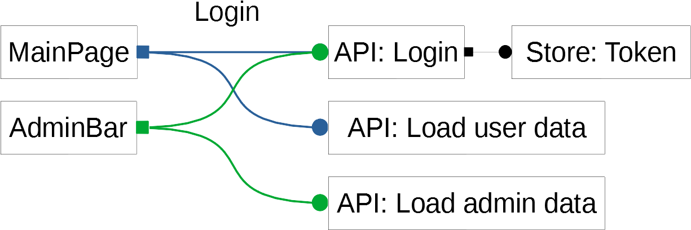

### Problem: Actions with responses

Sometimes it is necessary to dispatch an action for calling some side effect and then react to the response of that side effect. This is the same pattern as calling a function in the traditional way. After the function body the code of the caller gets executed again. So the caller can react to the functions response.
This command response pattern does not work with redux if multiple sources uses the same action. The problem is that an action holds no information about the caller, so a caller can not decide when to react to the response action of the called effect. All possible callers get the same response action.

### Solution: Actions with a target identifier

To use the command response pattern we introduce another action type, the multi target action. It is a multi source action with information in the payload about the target the action is for. The information is a unique target identifier in the style of the NgRx type identifier.
The action flow is as follows. A source dispatches a multi target action as a command with a target identifier. The reacting effect does some work and dispatches again a multi target action as a response with the same identifier. The part of the application which dispatched the initial action can react to that response action in an effect. This effect is the identified target and can handle the response if the identifier is correct. If the response's identifier points to another target it is ignored.
The multi target in contrast to the multi source action can be safely reused because targets explicitly react to the specified identifier. If used as intended it is not possible that some side effect the developer is unaware of reacts to a multi target action.

### MTA: Multi target action

The MTA action is the same as a MSA action with payload identifying the target.

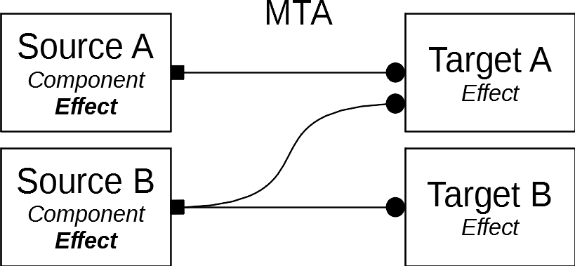

Where to use it:

* The action can be dispatched by multiple sources. Mainly it should be dispatched by effects.
* The action can have multiple targets. It is not recommended to use a reducer as a target for the action.

Where to define it:

* The corresponding MTA command and response actions should be defined in a seperate action file. It should be placed in the sub module folder of the effects/services handling the actions.

Precautions:

* A developer is allowed to reuse this action. He must define the identifier so that targets can react to that specific dispatch of the action.
* A developer is allowed to add a new target for the action. He must select the identifiers of the action the target should react to.

### Example: MTA

    OpenDialogMTA.type = '[Shared/Dialog] Open a confirmation dialog'

## Application flow and data storage actions

Actions can be separated in actions manipulating the application data and actions describing the application flow.

### Overview: Application flow action

An application flow action is an action that describes what happens next. It can have some payload further describing the state change. It does not manipulate application data in the store.

### Overview: Data storage action

A data storage action is an action manipulating the application data in the store. The payload contains the new data.

### Problem: Mixing application flow and data storage

By using the same action for describing the application flow and the change of the application data it becomes unclear for the developer what actually happens when dispatching such an action.

### Solution: SOA

We decided that SSA, MSA and MTA are actions describing the application flow only. For manipulating application data in the state we introduce the state operation action. Note that non SOA actions can also be reduced if the data is for describing the application flow.
By separating these two patterns it becomes clear for a developer what a dispatched action actually does. Also the separation allows that SOA actions are always safe to reuse.

### SOA: State operation action

The SOA action is an action manipulating the application data of the state. It should follow the CRUD guidelines. Whenever a source whants to change some data in the state it dispatches a SOA action. If an action desribes both a data change and the application flow it can be splitted into two actions, one of it the SOA action.
SOA actions are multi source actions. They have one reducer as a target so they are safe to reuse in contrast to normal MSA actions.

Where to use it:

* The action can be dispatched from multiple sources. Mainly it should be dispatched by effects.
* The action should be consumed by only one reducer. It is not allowed to write effects for the action.

Where to define it:

* SOA actions should be defined in a seperate action file in the state folder of the corresponding reducer.

Precautions:

* A developer is allowed to reuse this action.
* A developer is not allowed to add new targets for the action

### Example: SOA

    UpdateUserNameSOA.type = '[User/UserData] Sets a new user name'

## Summary

We decided to use all actions as commands. Command actions are defined where they are handled not where they are dispatched. They are like an interface for a part of the application.

We decided to mainly use single source and state operation actions. Multi source and multi target actions can be used if necessary.

### Purpose

Actions can describe the application flow or a change of the application data.

| Action | App flow | Data change |
| ------ | -------- | ----------- |
| SSA    | yes      | no          |
| MSA    | yes      | no          |
| MTA    | yes      | no          |
| SOA    | no       | yes         |

### Source

Actions can be dispatched from multiple components or effects.

| Action | Component   | Effect |
| ------ | ----------- | ------ |
| SSA    | single      | single |
| MSA    | yes       | yes  |
| MTA    | yes       | yes  |
| SOA    | rare | yes  |

### Target

Actions can be handled by multiple effects or reducers.

| Action | Effect | Reducer |
| ------ | ------ | ------- |
| SSA    | yes    | rare    |
| MSA    | yes    | rare    |
| MTA    | yes    | rare    |
| SOA    | no     | single  |

### Reuse

Already defined actions can be dispatched by new sources.
Already defined actions can be handled by new targets.

Reuse can be forbidden, safe or unsafe.

| Action | Source | Target |
| ------ | -------| ------ |
| SSA    | no     | safe   |
| MSA    | unsafe | unsafe |
| MTA    | safe   | safe   |
| SOA    | safe   | no     |
